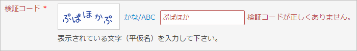
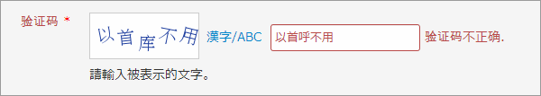

JCaptcha
========

アルファベット以外の文字(たとえば平仮名や漢字)を表示できる Yii-framework 用の CAPTCHA です。
CCaptcha を拡張しています。





動作条件
------------
+ Yii Version 1.1.13 以降
+ PHP GD + FreeType 拡張

使用方法
--------
1. "jcaptcha" ディレクトリを中身の 3 ファイルごと、アプリケーションの "extensions" ディレクトリに置きます。

		protected
		  extensions
		    jcaptcha
		      JCaptcha.php
		      JCaptchaAction.php
		      setofontmaru.ttf

2. ビュー・スクリプト中の "CCaptcha" を "ext.jcaptcha.JCaptcha" で置き換えます。

	```php
	<?php
	/* $this->widget('CCaptcha'); */
	$this->widget('ext.jcaptcha.JCaptcha');
	?>
	```

3. コントローラ・ファイル中の "CCaptchaAction" を "ext.jcaptcha.JCaptchaAction" で置き換えます。

	```php
	public function actions()
	{
		return array(
			'captcha'=>array(
				/* 'class'=>'CCaptchaAction', */
				'class'=>'ext.jcaptcha.JCaptchaAction',
				'backColor'=>0xFFFFFF,
			),
			...
		);
	}
	```

JCaptcha のプロパティ
-------------------
JCaptcha は CCaptcha のプロパティすべてに加えて、以下のプロパティをサポートします。
**(*)** マークを付けた項目は、使用時に変更することを予定した基本的なオプションです。

1. **showTypeChangeButton (*)**

	@var boolean  
	文字の種類を変更するボタンを表示するか否かを設定する。既定値は true 。  
	false の場合、文字の種類は非アルファベットに固定。true の場合は、ユーザがアルファベットを選択出来る。

2. **typeChangeButtonLabel (*)**

	@var string  
	文字の種類を変更するボタンのラベル。既定値は "かな/ABC"。  
	漢字や非日本語を使いたい場合は、ラベルを書き換えること。

3. useInnerCss

	@var boolean  
	画像とボタンに内部 CSS を使うか否か。既定値は true 。

JCaptchaAction のプロパティ
-------------------------
JCaptchaAction は CCaptchaAction のプロパティすべてに加えて、以下のプロパティをサポートします。
**(*)** マークを付けた項目は、使用時に変更することを予定した基本的なオプションです。

1. **minLengthJ (*)**

	@var integer  
	ランダムに生成される単語の最小文字数。既定値は 5

2. **maxLengthJ (*)**

	@var integer  
	ランダムに生成される単語の最大文字数。既定値は 5

3. **seeds (*)**

	@var string  
	ランダムな単語を生成するための種文字列。  
	既定値は、"あいうえおかきくけこがぎぐげごさしすせそざじずぜぞたちつてとだぢづでどなにぬねのはひふへほはひふへほはひふへほばびぶべぼぱぴぷぺぽまみむめもやゆよらりるれろわをん" という文字列。  

4. **fontFileJ (*)**

	@var string  
	非アルファベットを表示するために使用するフォントファイル。既定値は setofontmaru.ttf。  
	既定のフォントは平仮名と片仮名しかサポートしていないことに注意。

5. offsetJ

	@var integer  
	文字間のオフセット。既定値は 2.  
	このプロパティを調整して、文字の読み取りやすさを増減することができる。

6. fixedAngle

	@var boolean  
	文字にランダムな回転を与えずに表示するか否か。既定値は false。  
	動作環境や使用するフォントによっては、 true に設定する必要があるかも知れない。

7. checkSJISConversion

	@var boolean  
	true の場合、UTF-8 から Shift_JIS への変換が必要か否かをチェックして、それに従う。  
	既定値は false で、UTF-8 のまま文字を描画する。  
	動作環境によっては、 true に設定する必要があるかも知れない。

カスタマイズ
------------

以下は JCaptcha および JCaptchaAction をカスタマイズする方法を示すサンプルです。
ここでは中国語(簡体字)の CAPTCHA を表示します。

ビュー・スクリプト:

```php
<div class="row">
<?php echo $form->labelEx($model,'verifyCode')) ?>
<?php $this->widget('ext.jcaptcha.JCaptcha', array(
	'clickableImage' => true,
	'showRefreshButton'=> false,
	'showTypeChangeButton' => true,
	'buttonType' => 'link',
	'typeChangeButtonLabel' => '漢字/ABC',
	'imageOptions' => array(
		'width' => 120,
		'height' => 50,
		'title' => '请单击取得新的编码',
	)) ); ?>
<?php echo $form->textField($model,'verifyCode'); ?>
<?php echo $form->error($model,'verifyCode') ?>
<p class="hint">請輸入被表示的文字。</p>
</div>
```

コントローラ:

```php
	public function actions()
	{
		return array(
			'captcha' => array(
				'class' => 'ext.jcaptcha.JCaptchaAction',
				'seeds' => '几乎所有的应用程序都是建立在数据库之上虽然可以非常灵活的' .
					'操作数据库但有些时候一些设计的选择可以使它更便于使用首先应用程序' .
					'广泛使用了设计的考虑主要围绕优化使用而不是组成复杂语句实际上大多' .
					'的设计是使用友好的模式来解决实践中的问题最常用的方式是创建易于被' .
					'人阅读和理解的代码例如使用命名来传达意思但是这很难做到',
				'fontFileJ' => Yii::getPathOfAlias('ext.jcaptcha') . '/gbsn00lp.ttf',
				'backColor' => 0xFFFFFF,
			),
		);
	}

```

サンプル・コードでは、使用するフォント・ファイル ("gbsn00lp.ttf") をエクステンションと同じディレクトリに置いたものと仮定しています。

"seeds" に指定する文字に、使用するフォントで表示できない文字を含めないように注意して下さい。

履歴
----

+ Version 1.0.0 (2013-03-18)
	+ 最初のリリース
+ Version 1.0.1 (2013-03-18)
	+ バグ・フィックス

謝辞
----
[瀬戸フォント丸 setofontmaru.ttf](http://nonty.net/item/font/setofontmaru.php) をシェアして下さっている[瀬戸のぞみさん](http://nonty.net/about/) に感謝の意を表します。
