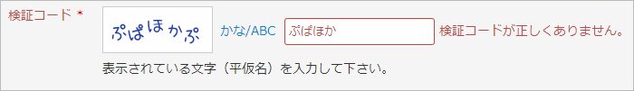

JCaptcha
========

Captcha for Yii-framework 1.1.x that can render non alphabetical characters. It's an extension of CCaptcha.




[日本語の README](README-ja.md)

Requirements
------------
+ Yii Version 1.1.13 or later
+ PHP GD + FreeType extension or PHP ImageMagick extension

It only works for Yii 1.1. Please use [softark/yii2-mb-captcha](https://github.com/softark/yii2-mb-captcha) for Yii 2.0.

Usage
-----
1. Place "jcaptcha" directory that contains 3 files in it under the extensions directory of the application.

		protected
		  extensions
		    jcaptcha
		      JCaptcha.php
		      JCaptchaAction.php
		      seto-mini.ttf

2. Replace "CCaptcha" with "ext.jcaptcha.JCaptcha" in your view script.

	```php
	<?php
	/* $this->widget('CCaptcha'); */
	$this->widget('ext.jcaptcha.JCaptcha');
	?>
	```

3. Replace "CCaptchaAction" with "ext.jcaptcha.JCaptchaAction" in your controller.

	```php
	public function actions()
	{
		return array(
			'captcha'=>array(
				/* 'class'=>'CCaptchaAction', */
				'class'=>'ext.jcaptcha.JCaptchaAction',
				'backColor'=>0xFFFFFF,
			),
			...
		);
	}
	```

Properties of JCaptcha
----------------------
JCaptcha supports all the properties of CCaptcha and the following additional ones.
The items with **(*)** are the basic options that you may want to configure.

1. **showTypeChangeButton (*)**

	@var boolean  
	Whether to show the button to change the character type. Defaults to true.  
	If false, the type of the characters is fixed to non alphabetical characters.
	If true, the user can select standard alphabetical captcha.

2. **typeChangeButtonLabel (*)**

	@var string  
	The label of the type change button. Defaults to "かな/ABC" ... "Japanese Hirakana/ABC".  
	You may want to change it if you want to use the characters of your own language, "漢字/ABC" for example.

3. useInnerCss

	@var boolean  
	Whether to use inner CSS for image and the buttons.	Defaults to true.

Properties of JCaptchaAction
----------------------------
JCaptchaAction supports all the properties of CCaptchaAction and the following additional ones.
The items with **(*)** are the basic options that you may want to configure.

1. **fontFileJ (*)**

	@var string  
	The font to be used for non-alphabetical characters. Defaults to seto-mini.ttf.  
	Note that **the default font only supports standard ASCII and Japanese Hirakana and Katakana**.
	You have to provide an appropriate font file if you want to render your choice of characters.

2. **seeds (*)**

	@var string  
	The string used for generating the random word. Defaults to a series of Japanese Hirakana characters: "あいうえおかきくけこがぎぐげごさしすせそざじずぜぞたちつてとだぢづでどなにぬねのはひふへほはひふへほはひふへほばびぶべぼぱぴぷぺぽまみむめもやゆよらりるれろわをん". Several characters randomly selected from this string will make up the captcha word.  
	You may set your own. Make sure that your `fontFileJ` can render all the characters in the `seeds`.

3. **minLengthJ (*)**

	@var integer  
	The minimum length for randomly generated word.	Defaults to 5

4. **maxLengthJ (*)**

	@var integer  
	The maximum length for randomly generated word.	Defaults to 5

5. offsetJ

	@var integer  
	The offset between characters. Defaults to 2.  
	You can adjust this property in order to decrease or increase the readability of the non alphabetical captcha.

6. fixedAngle

	@var boolean  
	Whether to render the non alphabetical captcha image with a fixed angle. Defaults to false.  
	You may want to set this to true if you have trouble rendering your font.

7. checkSJISConversion

	@var boolean  
	Whether to check if conversion to shift_JIS is needed. Defaults to false.

How to Customize
----------------

The following is a sample code that shows how to customize JCaptcha and JCaptchaAction.
It shows Chinese characters for the captcha.

In the view script:

```php
<div class="row">
<?php echo $form->labelEx($model,'verifyCode')) ?>
<?php $this->widget('ext.jcaptcha.JCaptcha', array(
	'clickableImage' => true,
	'showRefreshButton'=> false,
	'showTypeChangeButton' => true,
	'buttonType' => 'link',
	'typeChangeButtonLabel' => '漢字/ABC',
	'imageOptions' => array(
		'width' => 120,
		'height' => 50,
		'title' => '请单击取得新的编码',
	)) ); ?>
<?php echo $form->textField($model,'verifyCode'); ?>
<?php echo $form->error($model,'verifyCode') ?>
<p class="hint">請輸入被表示的文字。</p>
</div>
```

And in the controller:

```php
	public function actions()
	{
		return array(
			'captcha' => array(
				'class' => 'ext.jcaptcha.JCaptchaAction',
				'seeds' => '几乎所有的应用程序都是建立在数据库之上虽然可以非常灵活的' .
					'操作数据库但有些时候一些设计的选择可以使它更便于使用首先应用程序' .
					'广泛使用了设计的考虑主要围绕优化使用而不是组成复杂语句实际上大多' .
					'的设计是使用友好的模式来解决实践中的问题最常用的方式是创建易于被' .
					'人阅读和理解的代码例如使用命名来传达意思但是这很难做到',
				'fontFileJ' => Yii::getPathOfAlias('ext.jcaptcha') . '/gbsn00lp.ttf',
				'backColor' => 0xFFFFFF,
			),
		);
	}

```

Note that the sample code assumes that you have placed your choice of font file in the same directory as the extension.

You have to be careful not to include the characters in "seeds" that are not supported by your font.

History
-------

+ Version 1.0.0 (2013-03-18)
	+ Initial release
+ Version 1.0.1 (2013-03-18)
	+ Bug fix
+ Version 1.0.2 (2013-03-19)
	+ Replaced the default font
+ Version 1.0.3 (2013-03-23)
	+ Added imagick support, refactored the code

Acknowledgment
--------------
Many thanks to [瀬戸のぞみ (Nozomi Seto)](http://nonty.net/about/) for the wonderful work of [瀬戸フォント (setofont.ttf)](http://nonty.net/item/font/setofont.php). The default font "seto-mini.ttf" is a subset of setofont.ttf.

